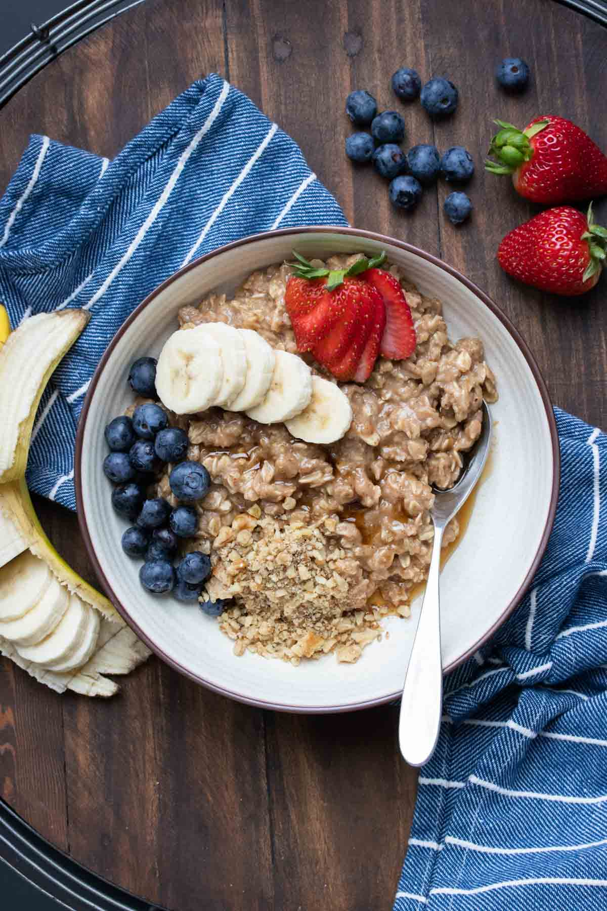

Breakfast Instructions

Table of Contents:

**[Avocado Toast](#avocado-toast) 1**

**[Omelet](#omelet) 2**

**[Pancake](#pancake) 3**

**[Oatmeal](#oatmeal) 5**

### Avocado Toast

-   Description

    -   Avocado toast is a tasty simple breakfast dish that only takes a
         few ingredients and very little time to prepare.

-   Tools

    -   Toaster

    -   Knife

-   Ingredients

    -   Bread

    -   One avocado

    -   Red Onion

    -   Cilantro

    -   Feta Cheese

When you are finished you should have something like this:

Steps:

1.  Use a kitchen knife to cut two slices of bread off of a loaf.

2.  Place the bread into the toaster and heat to preference.

3.  While the bread is toasting, chop up part of one red onion and some cilantro.

4.  When the bread is finished toasting, cut one avocado in half and scoop out the green part onto the toast.

5.  Add the chopped onion and cilantro as well as feta cheese to the top of the toast.

6.  Enjoy

### Omelet

-   Description

    -   An omelet is a tasty healthy breakfast meal that is super high in protein and healthy fats.

-   Tools

    -   Stove

    -   Pan

    -   Bowl

    -   Whisk

-   Ingredients

    -   Two eggs

    -   ¼ tablespoon salt

    -   1 teaspoon black pepper

    -   ½ tablespoon butter

    -   ½ cup of shredded cheese

When you are finished you should have something like this:

Steps:

1.  Crack two eggs and mix them in a bowl with salt and pepper using a whisk.

2.  Heat a pan on the stove to a medium temperature and then start melting the butter in the pan.

3.  Put the contents of your bowl into the pan and let it cook for about 20 seconds.

4.  Add the cheese to the pan and let the omelet cook for another 20 seconds.

5.  Flip the omelet over to cook the other side for 20 more seconds.

6.  Finally, serve on a plate and enjoy.

**Caution**: Be careful handling hot appliances including a pan. Failure
to do so could lead to being burned. To avoid burns only pick up the pan
by the handle. If you are burned run your hand under cool water for
30-60 seconds.

### Pancake

-   Description

    -   Vegan pancakes are easy to make and pretty healthy.

-   Tools

    -   Stove

    -   Pan

    -   Two Bowls

    -   Spatula

-   Ingredients

    -   1 cup flour

    -   1 tablespoon baking powder

    -   2 tablespoons brown sugar

    -   ½ teaspoon salt

    -   2 tablespoons coconut oil

    -   2 tablespoons of creamy peanut butter

    -   1 cup almond milk

When you are finished you should have something like this:

Steps:

1.  Mix the flour, baking powder, sugar, and salt in a bowl.

2.  In another bowl mix the coconut oil with the peanut butter.

3.  Add the liquid bowl to the solid bowl and then add 1 cup of milk.

4.  Mix all ingredients until you have a smooth batter.

5.  Add some coconut oil to the ban and then add the mix to the pan.

6.  After the bottom of the pancakes starts to brown, use a spatula to flip them.

7.  As the other sides of the pancakes start to turn brown use the spatula to move them onto a plate.

8.  Enjoy!

**Caution**: Be careful handling hot appliances including a pan. Failure
to do so could lead to being burned. To avoid burns only pick up the pan
by the handle. If you are burned run your hand under cool water for
30-60 seconds.

### Oatmeal

-   Description

    -   This is a delicious, simple, and super healthy oatmeal dish that is vegan.

-   Tools

    -   Microwave

    -   Bowl

    -   Knife

-   Ingredients

    -   ½ Cup oats

    -   ¼ Cup almond milk

    -   ½ cup water

    -   1 banana

    -   ¼ cup strawberries

    -   ¼ cup blueberries

When you are finished you should have something like this:

Steps:

1.  Add the oats and water to a bowl and mix well.

2.  Microwave on high for 60-90 seconds.

3.  While microwaving cut up 1 banana and the strawberries.

4.  When the microwave is finished add milk, banana wheels, strawberries, and blueberries to the bowl.

5.  Wait for the bowl and oatmeal to cool before enjoying.
